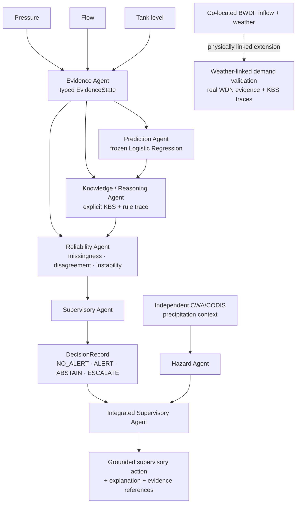

# WDS Sentinel

**Reliability-aware hybrid AI for water-distribution supervision under operational incidents, degraded evidence, and extreme-weather context.**

[](https://github.com/NaimurRahmanR/wds-sentinel/actions/workflows/ci.yml)
[](pyproject.toml)
[](LICENSE)
[](docs/research_protocol_status.md)

[**Technical report**](report/wds_sentinel_report.pdf) · [**Architecture**](docs/architecture.md) · [**Frozen protocol**](docs/research_protocol_status.md) · [**Results**](results/derived/) · [**Data provenance**](data/PROVENANCE.md)

> **Research question**  
> Can a hybrid AI supervisory system combine data-driven prediction, explicit knowledge-based reasoning, multi-agent coordination, and evidence-quality controls so that degraded or conflicting evidence becomes visible in the decision process rather than silently propagating into operational recommendations?

WDS Sentinel is an end-to-end research prototype built around **real water-distribution evidence**. The project deliberately preserves weak and negative predictive results: its central contribution is not a claim of high leak-detection accuracy, but an experimentally auditable architecture for **reliability-aware supervision, explicit abstention/escalation, traceable reasoning, and grounded decision support**.

> [!IMPORTANT]
> The frozen leak detector is weak out of time. This repository therefore does **not** claim operationally validated leak detection, universally lower selective risk, rainfall-caused hydraulic failure, or deployment readiness. The reliability claims concern how the system represents and responds to evidence quality.

## System at a glance



The operational WDS path uses BattLeDIM/L-Town SCADA evidence. The CWA/CODIS precipitation stream is intentionally **independent context** and never creates a rainfall-to-hydraulic causal claim. A separate BWDF experiment provides the physically linked weather-demand extension using inflow and weather measured within the same real WDN.

## What the project contributes

| Layer | Evidence implemented in this repository |
|---|---|
| **Data-driven modelling** | Frozen Logistic Regression onset detector using real multimodal BattLeDIM SCADA evidence. |
| **Hybrid AI / KBS** | Explicit deterministic facts, rules, contradiction handling, rule IDs and reasoning traces. |
| **Multi-agent system** | Typed Evidence, Prediction, Knowledge/Reasoning, Reliability, Hazard and Supervisory agents. |
| **Reliability control** | Fixed missingness, disagreement and instability gates with `ABSTAIN` / `ESCALATE`. |
| **Decision support / XAI** | Structured `DecisionRecord` outputs with executed rules, evidence references and grounded explanations. |
| **Evidence degradation** | Clean, missing-sensor-subset, additive-noise, conflicting-evidence and sensor-dropout conditions. |
| **Temporal validation** | Frozen 2018-developed system evaluated on 2019 without post-hoc retuning. |
| **Extreme-weather context** | Independent CWA/CODIS precipitation indicator plus a separate physically linked BWDF weather-demand validation. |
| **Reproducibility** | Bundled data, provenance/checksums, frozen configs, derived results, raw logs, tests, report source and CI. |

## Headline findings

| Experiment | Result | Interpretation |
|---|---|---|
| **Agent equivalence** | **264,900 / 264,900** exact System-C decision matches across five 2018 conditions | The typed agent architecture reproduces the frozen reliability-aware decision path exactly at row level. |
| **Severe missing-sensor condition** | System C autonomous coverage = **0** | The system withdraws autonomy completely; selective unsafe risk is **undefined**, not zero. |
| **2019 temporal detector** | AUPRC **0.004041**, AUROC **0.530564** | The underlying leak detector remains weak out of time. |
| **2019 event detection** | A/B/C each detect **1 of 19** genuine new onsets | Reliability control does not rescue weak predictive discrimination. |
| **2019 clean System C** | autonomous coverage **0.8617**, selective unsafe risk **0.002484** | System C exposes evidence-quality limits, but does **not** show lower selective risk than A/B on clean 2019 data. |
| **BWDF weather-aware forecast** | lower W1 MAE in **9 of 10 DMAs** | Co-located weather contains useful predictive signal for demand in this benchmark setting. |
| **DMA 2** | MAE **1.8261 → 1.4723 L/s** | **19.4%** W1 reduction versus previous-week baseline. |
| **DMA 3** | MAE **1.5626 → 1.3333 L/s** | **14.7%** W1 reduction versus previous-week baseline. |

The project treats the negative results as part of the evidence. It does not expand the model search until a favourable leak-detection result appears.

## Experimental design

### 1. Frozen WDS supervision experiment

Real BattLeDIM/L-Town 2018 evidence provides pressure, flow, tank level and leakage ground truth. The main early-onset detection task uses a chronological split:

- **training:** January–June 2018;
- **validation:** July–December 2018;
- **target:** timestamps from leak onset through +1 hour;
- **predictor:** balanced Logistic Regression with causal multimodal change features;
- **decision systems:**
  - **A — Direct:** predictor threshold only;
  - **B — Hybrid:** predictor + explicit statistical corroboration;
  - **C — Reliability-aware hybrid:** B plus evidence-quality gating with `ABSTAIN` / `ESCALATE`.

System C uses fixed reliability criteria for missingness, cross-group disagreement and instability. Coverage and selective unsafe risk are reported together so that abstention is not misrepresented as improved prediction.

### 2. Controlled evidence degradation

The frozen systems are evaluated under five conditions:

1. clean evidence;
2. missing sensor subset;
3. additive noise;
4. conflicting evidence;
5. sensor dropout.

The degradation study asks whether the system **detects when its evidence state is no longer trustworthy enough for autonomous supervision**, not whether corruption can be magically corrected.

### 3. Final 2019 temporal evaluation

The frozen 2018-developed multimodal predictor, A/B/C decision logic, degradation definitions and reliability cutoffs are applied to aligned 2019 pressure, flow, level and leakage data without retuning. The scored mask contains **105,108 rows**, **19 genuine new onsets**, and excludes four leaks already active on 2019-01-01 as carryovers.

On clean 2019 data the predictor achieves AUPRC **0.004041** and AUROC **0.530564**. A/B/C each detect **1/19** new onsets. System C has clean autonomous coverage **0.8617** and selective unsafe risk **0.002484**; this is not lower than A/B.

### 4. Independent extreme-precipitation context

A precipitation indicator is calibrated on 2013–2017 CWA/CODIS-derived daily observations and evaluated on 2018. It uses the training-period 95th percentile of trailing 1-, 3- and 7-day precipitation sums. The source-documented `-9.8` trace-precipitation code is converted to **0.09 mm**.

This stream is intentionally independent of L-Town. It contributes monitoring context such as `HAZARD_WATCH` or `ALERT_ELEVATED_HAZARD_CONTEXT`; it is **not** treated as WDS failure ground truth.

## Physically linked extreme-weather validation

The final extension uses the **Battle of Water Demand Forecasting (BWDF)** supplementary data, pairing hourly net inflow for ten real DMAs with rainfall, temperature, humidity and wind measured at a station within the same case-study WDN.

Training is frozen through **2022-07-24 23:00 Europe/Rome** and W1 (**2022-07-25–31**) is the evaluation week. Under the original BWDF protocol, evaluation-week weather was supplied as a perfect weather forecast, so current W1 weather is a legitimate exogenous input for the forecast comparison.

The training-only 95th-percentile threshold over positive daily rainfall is **18.775 mm/day**. During W1, a simple weather-aware Ridge model improves MAE over the previous-week baseline in **9/10 DMAs**. For the two pre-specified rainfall-sensitive residential DMAs identified by the benchmark publication:

- **DMA 2:** MAE **1.8261 → 1.4723 L/s** (**19.4% reduction**);
- **DMA 3:** MAE **1.5626 → 1.3333 L/s** (**14.7% reduction**).

Across the post-training period, both DMAs show lower same-hour previous-week demand residuals on 11 extreme-rain days than on 148 dry days. Extreme-minus-dry differences are **-0.432 L/s** for DMA 2 (descriptive bootstrap 95% interval **[-0.778, -0.141]**) and **-0.530 L/s** for DMA 3 (**[-0.966, -0.188]**).

Actual co-located evidence is exported through typed `EvidenceState` objects and explicit KBS rules into `WEATHER_LINKED_DEMAND_RESPONSE` decisions. This is observational evidence of a weather-linked operational demand response, not a causal rainfall-to-failure claim.

## Real-evidence integrated scenarios

`scripts/run_hazard_integration_scenarios.py` constructs five reproducible scenarios using **actual WDS validation outputs** and **actual precipitation observations**:

1. normal WDS row + normal hazard context;
2. detected leak-onset-window row + normal hazard context;
3. normal WDS row + elevated hazard context;
4. detected leak-onset-window row + elevated hazard context;
5. degraded leak-onset-window row + elevated hazard context.

The WDS and precipitation clocks remain explicit and may differ because the sources are unrelated. No WDS score, corroboration count, missingness value or sensor reading is hand-authored in the final integrated experiment.

## Repository map

```text
wds-sentinel/
├── src/wds_sentinel/        # package: evidence, prediction, KBS, agents, reliability
├── scripts/                 # experiment / validation / reproduction entry points
├── configs/                 # frozen protocol summaries and execution settings
├── data/
│   ├── raw/                 # BattLeDIM 2018/2019 SCADA + leakage data
│   ├── external/            # precipitation and BWDF linked-weather data
│   └── PROVENANCE.md        # source, checksum and provenance notes
├── results/
│   ├── raw/                 # captured run logs
│   └── derived/             # tables, traces, summaries and figures
├── report/                  # compiled technical report + LaTeX source
├── docs/                    # architecture, protocol and limitations
└── tests/                   # unit, regression and real-data integration tests
```

## Reproduce the results

Recommended: **Python 3.12**. Python 3.11 is also supported by the package metadata.

```bash
python -m venv .venv
source .venv/bin/activate          # Windows PowerShell: .venv\Scripts\Activate.ps1
python -m pip install --upgrade pip
python -m pip install -e ".[dev]"
pytest -q
```

The bundled-data suite currently contains **135 tests**, including real-data regressions for the BattLeDIM architecture and the physically linked BWDF result.

Run the principal experiments individually:

```bash
python scripts/run_reliability_experiment.py
python scripts/validate_agents_vs_frozen.py
python scripts/coverage_aware_evaluation.py
python scripts/run_hazard_integration_scenarios.py
python scripts/run_final_2019_evaluation.py
python scripts/run_linked_extreme_weather_validation.py
```

Or capture the main reproducibility logs in one run:

```bash
python scripts/reproduce_core_results.py
```

A direct-dependency snapshot is also provided:

```bash
python -m pip install -r requirements/dev.txt
python -m pip install -e . --no-deps
pytest -q
```

The complete 2018 agent-vs-frozen validation is intentionally heavier than the normal unit suite because it evaluates **264,900 condition-row comparisons**. The regular suite therefore contains a computationally bounded real-data regression.

## Verification state

- **135/135 tests** pass on the bundled-data suite;
- GitHub Actions installs the package from a fresh Ubuntu/Python 3.12 runner, runs correctness-focused Ruff checks, and executes the full test suite;
- BattLeDIM raw files are retained byte-for-byte and checked against the published upstream MD5 values;
- the compiled [technical report](report/wds_sentinel_report.pdf) and its [LaTeX source](report/wds_sentinel_report.tex) are versioned with the code;
- frozen/open research boundaries are documented in [research_protocol_status.md](docs/research_protocol_status.md).

## Data and third-party rights

The repository's original source code is licensed under the MIT License. **That licence does not apply to third-party datasets.** See [THIRD_PARTY_DATA_NOTICE.md](THIRD_PARTY_DATA_NOTICE.md) and [data/PROVENANCE.md](data/PROVENANCE.md) before redistributing or reusing data files.

BattLeDIM is publicly downloadable from Zenodo at DOI `10.5281/zenodo.4017659`. At the time of the repository audit, the record is marked as an open dataset but the displayed licence field is blank; this repository therefore does not claim that the BattLeDIM CSVs are public-domain or covered by the MIT code licence.

The precipitation observations ultimately originate from Taiwan's Central Weather Administration (CWA) / CODIS. The bundled copy was obtained from the `Raingel/historical_weather` rebuild. The source and transformation chain are documented separately because the rebuild repository and the underlying government observations have different provenance/rights considerations.

The BWDF workbooks are distributed by `WaterFutures/wf4bwdf` from the Alvisi et al. supplementary materials under **CC BY 4.0**. Exact bundled-file hashes and attribution are recorded in [data/PROVENANCE.md](data/PROVENANCE.md).

## Limitations

- the frozen WDS predictor is weak and should not be interpreted as operationally validated leak detection;
- only five 2018 validation onset events occur in the selected split, so event-level estimates are small-sample;
- the reliability gate demonstrates explicit evidence-quality control, not universally lower conditional risk;
- the severe missing-sensor condition intentionally produces zero autonomous coverage under the fixed policy;
- the CWA/CODIS precipitation context is independent of L-Town and is not a flood/damage predictor;
- the BWDF validation provides a real co-located weather-demand response but does not establish rainfall-caused hydraulic failure;
- the final 2019 temporal evaluation is not a pristine blind test: an earlier rejected forecasting baseline had inspected 2019 pressure/leakage, although subsequent detection-model, hybrid/KBS/MAS and reliability development used 2018 only;
- the 2019 target evaluates **new leak onsets**; four leaks already active on 2019-01-01 are treated as carryovers rather than new events.

## Citation

If this repository supports your research, please cite the software repository and, where relevant, the original third-party datasets separately.

```bibtex
@software{rahman2026wdssentinel,
  author  = {Rahman, Naimur},
  title   = {WDS Sentinel: Reliability-Aware Hybrid AI for Water-Distribution Supervision},
  year    = {2026},
  version = {0.1.0},
  url     = {https://github.com/NaimurRahmanR/wds-sentinel},
  note    = {Research prototype}
}
```

## Licence

Original source code: **MIT License**. Third-party datasets retain their own rights and licensing conditions; see the notices above.
